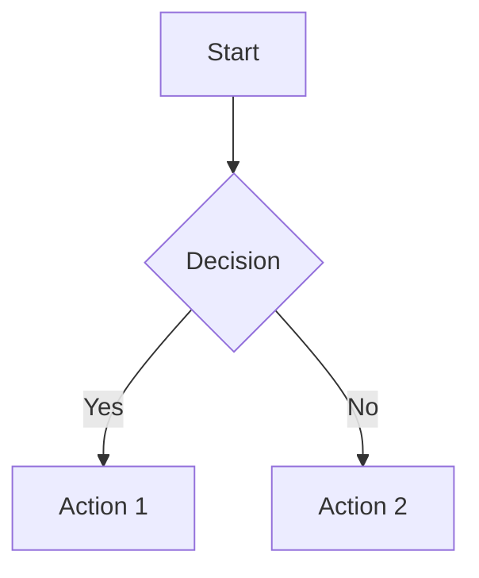

# GitHub Flavored Markdown Extensions

## Alert Annotations (Callouts)

```markdown
> [!NOTE]
> Useful information that users should know, even when skimming.

> [!TIP]
> Optional advice that helps users be more successful.

> [!IMPORTANT]
> Essential information users must know.

> [!WARNING]
> Potential risks or negative outcomes.

> [!CAUTION]
> Dangerous consequences if ignored.
```

### Best Practices
- Use sparingly — one per concern
- Never stack multiple alerts back-to-back
- Prefer NOTE and TIP over WARNING/CAUTION

## Collapsible Sections

```markdown
<details>
<summary>Click to expand</summary>

Hidden content here.
Can include code blocks, lists, etc.

</details>
```

## Mermaid Diagrams

```markdown

```

### Common Diagram Types
- `graph TD` - Top-down flowchart
- `graph LR` - Left-right flowchart
- `sequenceDiagram` - Sequence diagram
- `classDiagram` - Class diagram

## Badges

### Standard Shields.io Pattern
```markdown


```

### Dynamic Badges
```markdown


```

### Badge Order Convention
1. Build status
2. Version/release
3. Downloads (if applicable)
4. License
5. Language/platform

## Keyboard Notation

```markdown
Press <kbd>Ctrl</kbd> + <kbd>S</kbd> to save.
```

## Auto-References

GitHub automatically links:
- `#123` → Issue/PR #123
- `owner/repo#123` → Cross-repo reference
- `@username` → User mention
- `SHA` (7+ chars) → Commit

## Footnotes

```markdown
This needs a citation[^1].

[^1]: Reference details here.
```

## Emoji Usage

### Guidelines
- Use sparingly in headers only
- Never in prose text
- Be consistent: all sections or none

```markdown
## Features ✨
## Installation 🚀
```

## Math (LaTeX)

```markdown
$$
E = mc^2
$$
```
