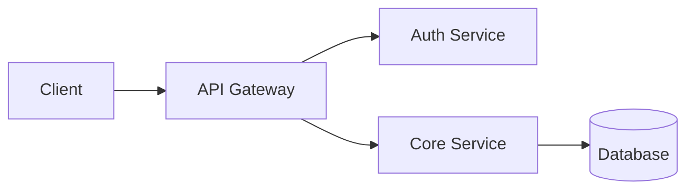

# GitHub Elements

## When to Use

Any time you are writing or reviewing a README or markdown file that will be rendered on GitHub. GitHub supports a superset of CommonMark with its own extensions. Use them intentionally to improve scannability, navigation, and visual hierarchy.

## Instructions

Apply the following GitHub-specific markdown extensions to produce professional, well-structured documentation.


### Alerts (Annotations)

GitHub renders five alert types as colored callout blocks. Use them sparingly and only when the content genuinely warrants the visual weight.

```markdown
> [!NOTE]
> Highlights information the reader should know even when skimming.

> [!TIP]
> Optional advice that helps the reader do something better or faster.

> [!IMPORTANT]
> Information the reader must have to use the project correctly.

> [!WARNING]
> Potential risk the reader should know before proceeding.

> [!CAUTION]
> Consequences of actions that may be hard or impossible to reverse.
```

Rules:
* Use `[!NOTE]` for supplementary context that does not block understanding.
* Use `[!IMPORTANT]` for prerequisites, breaking changes, or non-obvious requirements.
* Use `[!WARNING]` for side effects, destructive operations, or security concerns.
* Use `[!CAUTION]` for irreversible actions like deleting data or billing consequences.
* Never stack multiple alerts back-to-back. If you need two in a row, rewrite the section.

## Badges

Badges go in the header, immediately after the title or tagline. Group them logically: CI status first, then version/release, then meta (license, language, coverage).

### Common Patterns

```markdown

[](https://www.npmjs.com/package/package-name)
[](https://crates.io/crates/crate-name)
[](https://pypi.org/project/package-name/)
[](./LICENSE)
[](https://codecov.io/gh/owner/repo)
```

### shields.io Parameters Worth Knowing

* `?style=flat-square` for a cleaner, lower-profile look
* `?color=` to override the right-side color (hex or named)
* `?logo=` to add a simple icon (uses Simple Icons slugs)
* `?label=` to override the left-side label text
* `?cacheSeconds=` to control how stale the badge can be

Rules:
* Do not use more than 6-7 badges. A badge wall is noise.
* Always link badges to the thing they represent (the CI run, the registry page, etc.).
* Use GitHub Actions badge URLs for CI, not third-party services, when the project is on GitHub.
* Keep badge alt text descriptive (`![CI status]`, not `![badge]`).

## Banners and Header Images

A banner image at the top of a README can anchor a project's visual identity. Keep it functional, not decorative for its own sake.

```markdown
<div align="center">
  
  <p>One-line description of the project.</p>
</div>
```

Rules:
* Always include meaningful `alt` text on images.
* Specify `width` to prevent giant raw images from breaking the layout.
* Store assets in `docs/` or `.github/` to keep the root clean.
* Dark mode: GitHub supports `picture` + `prefers-color-scheme` for theme-aware images:

```markdown
<picture>
  <source media="(prefers-color-scheme: dark)" srcset="./docs/banner-dark.png" />
  <source media="(prefers-color-scheme: light)" srcset="./docs/banner-light.png" />
  
</picture>
```

## References and Cross-Linking

GitHub auto-links many reference formats. Use them instead of raw URLs where possible, they are shorter and more readable in the source.

| What | Syntax | Result |
|---|---|---|
| Issue | `#42` | Links to issue 42 in the same repo |
| PR | `#42` | Links to PR 42 in the same repo |
| Cross-repo issue | `owner/repo#42` | Links to issue in another repo |
| Commit | `abc1234` (7+ chars) | Links to that commit |
| User mention | `@username` | Links to a GitHub profile |
| Team mention | `@org/team-name` | Mentions a team |
| Release | `v1.2.3` in a release note | Auto-linked in release pages |

For internal doc links, prefer relative paths over absolute GitHub URLs. They work across forks, branches, and local clones.

```markdown
See [contributing guide](./CONTRIBUTING.md) and [architecture notes](./docs/architecture.md).
```

## Collapsible Sections

Use `<details>` to progressively disclose content that would otherwise interrupt reading flow: long changelogs, full configuration references, extended examples.

```markdown
<details>
<summary>Full configuration reference</summary>

```yaml
key: value
another_key: another_value
```

</details>
```

Rules:
* Write the `<summary>` as a clear action or topic, not "click here" or "more".
* Leave a blank line between `<summary>` and the body content or markdown won't render inside.
* Do not collapse critical content (installation steps, quickstart). Only collapse supplementary depth.

## Mermaid Diagrams

GitHub renders Mermaid natively inside fenced code blocks tagged `mermaid`. Use them for architecture overviews, data flows, state machines, and entity relationships.

```markdown

```

Supported diagram types: `flowchart`, `sequenceDiagram`, `classDiagram`, `stateDiagram-v2`, `erDiagram`, `gantt`, `pie`, `gitGraph`, `mindmap`.

Rules:
* Prefer Mermaid over external diagram image links when the diagram is simple enough. It renders in dark mode automatically and stays in sync with the source.
* For complex diagrams that Mermaid can't express cleanly, use a PNG/SVG committed to the repo with a source file link nearby.
* Always test Mermaid locally or via the [Mermaid Live Editor](https://mermaid.live) before committing. Syntax errors render as a broken block on GitHub.

## Task Lists

Task lists render as interactive checkboxes on GitHub issue and PR bodies, and as static visual checklists in READMEs.

```markdown
* [x] Core feature complete
* [x] Tests passing
* [ ] Documentation updated
* [ ] Changelog entry added
```

Use them in READMEs for project status roadmaps, release checklists, and setup step confirmations.

## Footnotes

GitHub renders footnotes as linked superscripts with a footnote list at the bottom.

```markdown
This uses a well-known algorithm[^1] for deduplication.

[^1]: Described in Smith et al. 2021, https://example.com/paper
```

Use footnotes for citations, caveats, and version-specific notes that would clutter the main prose.

## Tables

GitHub tables support alignment via colons in the separator row.

```markdown
| Left | Center | Right |
|:-----|:------:|------:|
| text | text   | text  |
```

Rules:
* Always include a header row and separator row.
* Keep cell content short. For long content, link out or use a collapsible section instead.
* Use tables for comparisons, configuration option references, and command glossaries.

## Keyboard Shortcut Notation

Use `<kbd>` for keyboard shortcuts. GitHub renders it as a styled key cap.

```markdown
Press <kbd>Ctrl</kbd>+<kbd>C</kbd> to copy.
```

## Writing Process for GitHub-Optimized READMEs

1. Place badges immediately after the title, before any prose.
2. Add a banner image only if the project has a real visual identity. Skip it for utility libraries and internal tools.
3. Use alerts for prerequisites, breaking changes, and security warnings. One alert per distinct concern.
4. Replace plain prose architecture descriptions with a Mermaid flowchart if the system has more than two components.
5. Collapse any section that exceeds ~20 lines and is not part of the critical path (install, quickstart).
6. Use GitHub auto-references instead of raw URLs for issues, PRs, and commits.
7. Add a task list to the roadmap or status section if the project is actively developed.
8. Verify the final output renders correctly by pasting into a GitHub gist or the preview tab of a new PR.
